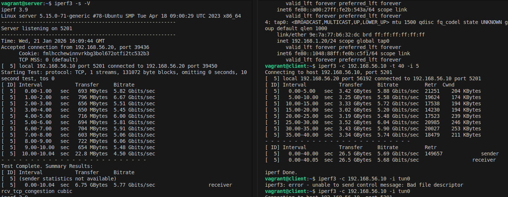

1.Настроить VPN между двумя ВМ в tun/tap режимах, замерить скорость в туннелях, сделать вывод об отличающихся показателях
2.Поднять RAS на базе OpenVPN с клиентскими сертификатами, 
подключиться с локальной машины на ВМ

1.
Tap

vagrant@server:~$ sudo openvpn --genkey secret /etc/openvpn/static.key
vagrant@server:~$ nano /etc/openvpn/
client/             server/             static.key          update-resolv-conf  
vagrant@server:~$ nano /etc/openvpn/server.conf
vagrant@server:~$ sudo nano /etc/openvpn/server.conf
vagrant@server:~$ sudo nano /etc/systemd/system
system/      system.conf  
vagrant@server:~$ sudo nano /etc/systemd/system
system/      system.conf  
vagrant@server:~$ sudo nano /etc/systemd/system/openvpn@.service
vagrant@server:~$ systemctl start openvpn@server
==== AUTHENTICATING FOR org.freedesktop.systemd1.manage-units ===
Authentication is required to start 'openvpn@server.service'.
Authenticating as: Ubuntu (ubuntu)
Password: 
polkit-agent-helper-1: pam_authenticate failed: Authentication failure
==== AUTHENTICATION FAILED ===
Failed to start openvpn@server.service: Access denied
See system logs and 'systemctl status openvpn@server.service' for details.
vagrant@server:~$ sudo systemctl start openvpn@server
vagrant@server:~$ sudo systemctl enable openvpn@server
Created symlink /etc/systemd/system/multi-user.target.wants/openvpn@server.service → /etc/systemd/system/openvpn@.service.
vagrant@server:~$ sudo systemctl status openvpn@server

vagrant@server:~$ sudo systemctl status openvpn@server
● openvpn@server.service - OpenVPN Tunneling Application On server
     Loaded: loaded (/etc/systemd/system/openvpn@.service; enabled; vendor preset: enabled)
     Active: active (running) since Sun 2026-01-18 20:36:51 UTC; 28s ago
   Main PID: 3758 (openvpn)
     Status: "Pre-connection initialization successful"
      Tasks: 1 (limit: 1115)
     Memory: 1.6M
        CPU: 17ms
     CGroup: /system.slice/system-openvpn.slice/openvpn@server.service
             └─3758 /usr/sbin/openvpn --cd /etc/openvpn/ --config server.conf

Jan 18 20:36:51 server systemd[1]: Starting openvpn@server.service...
Jan 18 20:36:51 server openvpn[3758]: 2026-01-18 20:36:51 WARNING: Compression for receiving enabled. Compres>
Jan 18 20:36:51 server systemd[1]: Started openvpn@server.service.

-----------------------------------------------------------

vagrant@client:~$ nano /etc/openvpn/server.conf
vagrant@client:~$ sudo nano /etc/openvpn/server.conf
vagrant@client:~$ nano /etc/op
openvpn/ opt/     
vagrant@client:~$ sudo nano /etc/openvpn/static.key
vagrant@client:~$ ll /etc/openvpn/static.key
-rw-r--r-- 1 root root 636 Jan 18 20:39 /etc/openvpn/static.key
vagrant@client:~$ chmod 600 /etc/openvpn/static.key
chmod: changing permissions of '/etc/openvpn/static.key': Operation not permitted
vagrant@client:~$ sudo chmod 600 /etc/openvpn/static.key
vagrant@client:~$ ll /etc/openvpn/static.key
-rw------- 1 root root 636 Jan 18 20:39 /etc/openvpn/static.key

vagrant@client:~$ sudo systemctl start openvpn@server
vagrant@client:~$ sudo systemctl enable openvpn@server
Created symlink /etc/systemd/system/multi-user.target.wants/openvpn@server.service → /etc/systemd/system/openvpn@.service.

 /home/kas/Рабочий стол/Crieket_lesson/BR-TUN-VPN/iperf_tap.png

TUN
Тоже самое проделалось интерфейсе типа tun0

Колосальную разницу в скорости не заметил.

2.
 RAS на базе OpenVPN

root@server:/etc/openvpn# systemctl status openvpn@server.service 
● openvpn@server.service - OpenVPN Tunneling Application On server
     Loaded: loaded (/etc/systemd/system/openvpn@.service; enabled; vendor preset: enabled)
     Active: active (running) since Sun 2026-02-15 10:45:54 UTC; 17s ago
   Main PID: 3641 (openvpn)
     Status: "Initialization Sequence Completed"
      Tasks: 1 (limit: 1115)
     Memory: 3.0M
        CPU: 12ms
     CGroup: /system.slice/system-openvpn.slice/openvpn@server.service
             └─3641 /usr/sbin/openvpn --cd /etc/openvpn/ --config server.conf

Feb 15 10:45:54 server systemd[1]: Starting OpenVPN Tunneling Application On server...
Feb 15 10:45:54 server systemd[1]: Started OpenVPN Tunneling Application On server.

Проверка подключения к серверу

root@Home:/etc/openvpn# openvpn --config client.conf
2026-02-15 13:48:05 Note: --cipher is not set. OpenVPN versions before 2.5 defaulted to BF-CBC as fallback when cipher negotiation failed in this case. If you need this fallback please add '--data-ciphers-fallback BF-CBC' to your configuration and/or add BF-CBC to --data-ciphers.
2026-02-15 13:48:05 Note: Kernel support for ovpn-dco missing, disabling data channel offload.
2026-02-15 13:48:05 OpenVPN 2.6.14 x86_64-pc-linux-gnu [SSL (OpenSSL)] [LZO] [LZ4] [EPOLL] [PKCS11] [MH/PKTINFO] [AEAD] [DCO]
2026-02-15 13:48:05 library versions: OpenSSL 3.0.13 30 Jan 2024, LZO 2.10
2026-02-15 13:48:05 DCO version: N/A
2026-02-15 13:48:06 TCP/UDP: Preserving recently used remote address: [AF_INET]192.168.56.10:1207
2026-02-15 13:48:06 Socket Buffers: R=[212992->212992] S=[212992->212992]
2026-02-15 13:48:06 UDPv4 link local: (not bound)
2026-02-15 13:48:06 UDPv4 link remote: [AF_INET]192.168.56.10:1207
2026-02-15 13:48:06 TLS: Initial packet from [AF_INET]192.168.56.10:1207, sid=6ba24247 a660f9e4
2026-02-15 13:48:06 VERIFY OK: depth=1, CN=RAS
2026-02-15 13:48:06 VERIFY KU OK
2026-02-15 13:48:06 Validating certificate extended key usage
2026-02-15 13:48:06 ++ Certificate has EKU (str) TLS Web Server Authentication, expects TLS Web Server Authentication
2026-02-15 13:48:06 VERIFY EKU OK
2026-02-15 13:48:06 VERIFY OK: depth=0, CN=rasvpn
2026-02-15 13:48:06 Control Channel: TLSv1.3, cipher TLSv1.3 TLS_AES_256_GCM_SHA384, peer certificate: 2048 bits RSA, signature: RSA-SHA256, peer temporary key: 253 bits X25519
2026-02-15 13:48:06 [rasvpn] Peer Connection Initiated with [AF_INET]192.168.56.10:1207
2026-02-15 13:48:06 TLS: move_session: dest=TM_ACTIVE src=TM_INITIAL reinit_src=1
2026-02-15 13:48:06 TLS: tls_multi_process: initial untrusted session promoted to trusted
2026-02-15 13:48:06 PUSH: Received control message: 'PUSH_REPLY,route-gateway 10.10.10.1,topology subnet,ping 10,ping-restart 120,ifconfig 10.10.10.2 255.255.255.0,peer-id 1,cipher AES-256-GCM'
2026-02-15 13:48:06 OPTIONS IMPORT: --ifconfig/up options modified
2026-02-15 13:48:06 OPTIONS IMPORT: route-related options modified
2026-02-15 13:48:06 net_route_v4_best_gw query: dst 0.0.0.0
2026-02-15 13:48:06 net_route_v4_best_gw result: via 172.20.10.1 dev enx2232c67017d7
2026-02-15 13:48:06 ROUTE_GATEWAY 172.20.10.1/255.255.255.240 IFACE=enx2232c67017d7 HWADDR=22:32:c6:70:17:d7
2026-02-15 13:48:06 TUN/TAP device tun0 opened
2026-02-15 13:48:06 net_iface_mtu_set: mtu 1500 for tun0
2026-02-15 13:48:06 net_iface_up: set tun0 up
2026-02-15 13:48:06 net_addr_v4_add: 10.10.10.2/24 dev tun0
2026-02-15 13:48:06 net_route_v4_add: 192.168.56.0/24 via 10.10.10.1 dev [NULL] table 0 metric -1
2026-02-15 13:48:06 Initialization Sequence Completed
2026-02-15 13:48:06 Data Channel: cipher 'AES-256-GCM', peer-id: 1
2026-02-15 13:48:06 Timers: ping 10, ping-restart 120
^C2026-02-15 13:48:46 event_wait : Interrupted system call (fd=-1,code=4)
2026-02-15 13:48:46 net_route_v4_del: 192.168.56.0/24 via 10.10.10.1 dev [NULL] table 0 metric -1
2026-02-15 13:48:46 Closing TUN/TAP interface
2026-02-15 13:48:46 net_addr_v4_del: 10.10.10.2 dev tun0
2026-02-15 13:48:46 SIGINT[hard,] received, process exiting

root@server:/etc/openvpn# ping 10.10.10.1
PING 10.10.10.1 (10.10.10.1) 56(84) bytes of data.
64 bytes from 10.10.10.1: icmp_seq=1 ttl=64 time=0.034 ms
64 bytes from 10.10.10.1: icmp_seq=2 ttl=64 time=0.047 ms
^C
--- 10.10.10.1 ping statistics ---
2 packets transmitted, 2 received, 0% packet loss, time 1006ms
rtt min/avg/max/mdev = 0.034/0.040/0.047/0.006 ms

default via 10.0.2.2 dev enp0s3 proto dhcp src 10.0.2.15 metric 100 
10.0.2.0/24 dev enp0s3 proto kernel scope link src 10.0.2.15 metric 100 
10.0.2.2 dev enp0s3 proto dhcp scope link src 10.0.2.15 metric 100 
10.0.2.3 dev enp0s3 proto dhcp scope link src 10.0.2.15 metric 100 
 -- >> 10.10.10.0/24 dev tun0 proto kernel scope link src 10.10.10.1 << -- 
192.168.56.0/24 dev enp0s8 proto kernel scope link src 192.168.56.10 