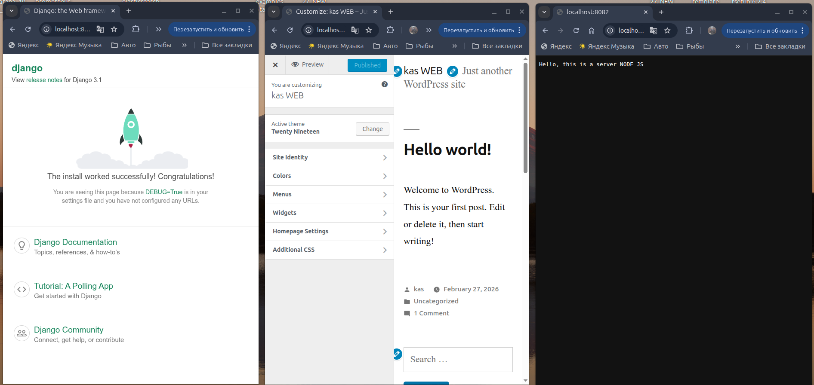

Стэнд.
nginx + php-fpm (wordpress) + python (django) + js(node);

деплой через docker-compose.

vagrant стэнд с проброшенными на локалхост портами

kas@Home:~/Crieket_lesson/DynamicWEB$ vagrant up --provision -vv
Bringing machine 'DynamicWeb' up with 'virtualbox' provider...
==> DynamicWeb: Checking if box 'ubuntu/22.04' version '1.0.0' is up to date...
==> DynamicWeb: Running provisioner: ansible...
    DynamicWeb: Running ansible-playbook...
[WARNING]: Deprecation warnings can be disabled by setting `deprecation_warnings=False` in ansible.cfg.
[DEPRECATION WARNING]: The '--inventory-file' argument is deprecated. This feature will be removed from ansible-core version 2.23. Use -i or --inventory instead.

PLAY [Install DynamicWeb stack] ************************************************

TASK [Install docker packages] *************************************************
ok: [DynamicWeb] => (item=apt-transport-https)
[WARNING]: Host 'DynamicWeb' is using the discovered Python interpreter at '/usr/bin/python3.10', but future installation of another Python interpreter could cause a different interpreter to be discovered. See https://docs.ansible.com/ansible-core/2.20/reference_appendices/interpreter_discovery.html for more information.
ok: [DynamicWeb] => (item=ca-certificates)
ok: [DynamicWeb] => (item=curl)
ok: [DynamicWeb] => (item=software-properties-common)

TASK [Add Docker s official GPG key] *******************************************
ok: [DynamicWeb]

TASK [Verify that we have the key with the fingerprint] ************************
ok: [DynamicWeb]

TASK [Set up the stable repository] ********************************************
ok: [DynamicWeb]

TASK [Update apt packages] *****************************************************
changed: [DynamicWeb]

TASK [Install docker] **********************************************************
ok: [DynamicWeb]

TASK [Add remote "vagrant" user to "docker" group] *****************************
ok: [DynamicWeb]

TASK [Install Docker Compose V2] ***********************************************
ok: [DynamicWeb]

TASK [Copy project] ************************************************************
ok: [DynamicWeb]

TASK [reset ssh connection] ****************************************************

TASK [Run container] ***********************************************************
changed: [DynamicWeb]

PLAY RECAP *********************************************************************
DynamicWeb                 : ok=10   changed=2    unreachable=0    failed=0    skipped=0    rescued=0    ignored=0 

vagrant@DynamicWeb:~/docker$ docker ps
CONTAINER ID   IMAGE                        COMMAND                  CREATED         STATUS         PORTS                                                                   NAMES
205f9eb5230e   nginx:1.15.12-alpine         "nginx -g 'daemon of…"   7 minutes ago   Up 7 minutes   80/tcp, 0.0.0.0:8081-8083->8081-8083/tcp, :::8081-8083->8081-8083/tcp   nginx
77605cbd6715   wordpress:5.1.1-fpm-alpine   "docker-entrypoint.s…"   7 minutes ago   Up 7 minutes   9000/tcp                                                                wordpress
e36051dd5598   docker-app                   "gunicorn --workers=…"   7 minutes ago   Up 7 minutes                                                                           app
546919bef1a5   node:16.13.2-alpine3.15      "docker-entrypoint.s…"   7 minutes ago   Up 7 minutes                                                                           node
96b6ca312102   mysql:5.7                    "docker-entrypoint.s…"   7 minutes ago   Up 7 minutes   3306/tcp, 33060/tcp                                                     database

 /home/kas/Crieket_lesson/DynamicWEB/dynamicweb.png

Подняты 3 web