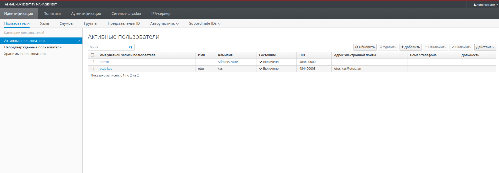

Домашнее задание
LDAP

Цель:
Научиться настраивать LDAP-сервер и подключать к нему LDAP-клиентов;

1. Установить FreeIPA
2. Написать Ansible-playbook для конфигурации клиента

1. Установлен ipa-server .Получен тикет на сервере для Admin

[root@ipa ~]# klist 
klist: Credentials cache 'KCM:0' not found
[root@ipa ~]# kinit admin
Password for admin@OTUS.LAN: 
[root@ipa ~]# klist 
Ticket cache: KCM:0
Default principal: admin@OTUS.LAN

Valid starting       Expires              Service principal
02/23/2026 20:18:25  02/24/2026 20:08:34  krbtgt/OTUS.LAN@OTUS.LAN
[root@ipa ~]# 

2. Видим что playbook ansible для клиентов отработал, установлен ipa-client

TASK [install module ipa-client] ***********************************************
ok: [client1.otus.lan]
ok: [client2.otus.lan]

TASK [add host to ipa-server] **************************************************
changed: [client1.otus.lan]
changed: [client2.otus.lan]

PLAY RECAP *********************************************************************
client1.otus.lan           : ok=9    changed=3    unreachable=0    failed=0    skipped=0    rescued=0    ignored=0   
client2.otus.lan           : ok=9    changed=3    unreachable=0    failed=0    skipped=0    rescued=0    ignored=0   

kas@Home:~/Crieket_lesson/LDAP$ vagrant ssh client1.otus.lan
Last login: Mon Feb 23 20:16:11 2026 from 192.168.56.1
[vagrant@client1 ~]$ sudo -i

Получаем тикетдля admin с клиента 1.

[root@client1 ~]# kinit admin
Password for admin@OTUS.LAN: 
[root@client1 ~]# klist
Ticket cache: KCM:0
Default principal: admin@OTUS.LAN

Valid starting       Expires              Service principal
02/23/2026 20:19:15  02/24/2026 19:57:15  krbtgt/OTUS.LAN@OTUS.LAN

ДОбавляем new пользователя otus-kas

[root@client1 ~]# ipa user-add otus-kas --first=otus --last=kas --password
Password: 
Enter Password again to verify: 
---------------------
Added user "otus-kas"
---------------------
  User login: otus-kas
  First name: otus
  Last name: kas
  Full name: otus kas
  Display name: otus kas
  Initials: ok
  Home directory: /home/otus-kas
  GECOS: otus kas
  Login shell: /bin/sh
  Principal name: otus-kas@OTUS.LAN
  Principal alias: otus-kas@OTUS.LAN
  User password expiration: 20260223172046Z
  Email address: otus-kas@otus.lan
  UID: 484400003
  GID: 484400003
  Password: True
  Member of groups: ipausers
  Kerberos keys available: True

Получаем тиет для otus-kas

[root@client1 ~]# kinit otus-kas
Password for otus-kas@OTUS.LAN: 
Password expired.  You must change it now.
Enter new password: 
Enter it again: 
Password change rejected: Password is too short
Password not changed..  Please try again.
Enter new password: 
Enter it again: 
[root@client1 ~]# klist
Ticket cache: KCM:0:55437
Default principal: otus-kas@OTUS.LAN

Valid starting       Expires              Service principal
02/23/2026 20:26:01  02/24/2026 19:53:30  krbtgt/OTUS.LAN@OTUS.LAN

 /home/kas/Crieket_lesson/LDAP/ipa-GUI-view.png