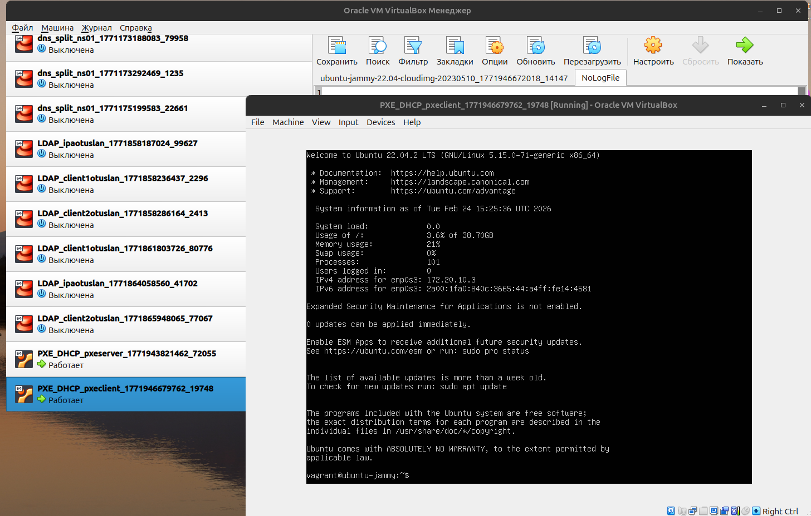

Домашнее задание
Настройка PXE сервера для автоматической установки

Цель:
Отработать навыки установки и настройки DHCP, TFTP, PXE загрузчика и автоматической загрузки


1. Настроить загрузку по сети дистрибутива Ubuntu 24
2. Установка должна проходить из HTTP-репозитория.

kas@Home:~/Crieket_lesson/PXE_DHCP$ vagrant up --provision
Bringing machine 'pxeserver' up with 'virtualbox' provider...
Bringing machine 'pxeclient' up with 'virtualbox' provider...
==> pxeserver: Checking if box 'ubuntu/22.04' version '1.0.0' is up to date...
==> pxeserver: Running provisioner: ansible...
    pxeserver: Running ansible-playbook...
[WARNING]: Deprecation warnings can be disabled by setting `deprecation_warnings=False` in ansible.cfg.
[DEPRECATION WARNING]: The '--inventory-file' argument is deprecated. This feature will be removed from ansible-core version 2.23. Use -i or --inventory instead.

PLAY [PXE manual install] ******************************************************

TASK [Gathering Facts] *********************************************************
[WARNING]: Host 'pxeserver' is using the discovered Python interpreter at '/usr/bin/python3.10', but future installation of another Python interpreter could cause a different interpreter to be discovered. See https://docs.ansible.com/ansible-core/2.20/reference_appendices/interpreter_discovery.html for more information.
ok: [pxeserver]

TASK [pxe_m : Check if UFW is installed] ***************************************
ok: [pxeserver]

TASK [pxe_m : Disable UFW if installed] ****************************************
changed: [pxeserver]

TASK [pxe_m : Stop and disable UFW service] ************************************
ok: [pxeserver]

TASK [pxe_m : base soft] *******************************************************
ok: [pxeserver]

TASK [pxe_m : Set up timezone] *************************************************
ok: [pxeserver]

TASK [pxe_m : enable chrony] ***************************************************
changed: [pxeserver]

TASK [pxe_m : copy /etc/dnsmasq.d/pxe.conf] ************************************
ok: [pxeserver]

TASK [pxe_m : create a directory /srv/tftp if it does not exist] ***************
ok: [pxeserver]

TASK [pxe_m : Download Plucky Netboot archive] *********************************
ok: [pxeserver]

TASK [pxe_m : Extract Plucky Netboot archive to /srv/tftp] *********************
changed: [pxeserver]

TASK [pxe_m : Restart dnsmasq service] *****************************************
changed: [pxeserver]

TASK [pxe_m : create a directory /srv/images if it does not exist] *************
ok: [pxeserver]

TASK [pxe_m : Download Ubuntu Live Server ISO] *********************************
ok: [pxeserver]

TASK [pxe_m : copy /etc/apache2/sites-available/ks-server.conf] ****************
ok: [pxeserver]

TASK [pxe_m : Enable ks-server Apache site] ************************************
ok: [pxeserver]

TASK [pxe_m : copy /srv/tftp/amd64/pxelinux.cfg/default] ***********************
changed: [pxeserver]

TASK [pxe_m : Restart apache2 service] *****************************************
changed: [pxeserver]

PLAY RECAP *********************************************************************
pxeserver                  : ok=18   changed=6    unreachable=0    failed=0    skipped=0    rescued=0    ignored=0   

``` pxeclient: Importing base box 'ubuntu/22.04'...
==> pxeclient: Matching MAC address for NAT networking...
==> pxeclient: Checking if box 'ubuntu/22.04' version '1.0.0' is up to date...
==> pxeclient: Setting the name of the VM: PXE_DHCP_pxeclient_1771946478618_89968
==> pxeclient: Fixed port collision for 22 => 2222. Now on port 2200.
==> pxeclient: Clearing any previously set network interfaces...
==> pxeclient: Preparing network interfaces based on configuration...
    pxeclient: Adapter 1: nat
==> pxeclient: Forwarding ports...
    pxeclient: 22 (guest) => 2200 (host) (adapter 1)
==> pxeclient: Running 'pre-boot' VM customizations...
==> pxeclient: Booting VM...
==> pxeclient: Waiting for machine to boot. This may take a few minutes...
    pxeclient: SSH address: 127.0.0.1:22
    pxeclient: SSH username: vagrant
    pxeclient: SSH auth method: private key
    pxeclient: Warning: Authentication failure. Retrying...
    pxeclient: Warning: Authentication failure. Retrying...
    pxeclient: Warning: Authentication failure. Retrying...
    pxeclient: Warning: Authentication failure. Retrying...
    pxeclient: Warning: Authentication failure. Retrying...
    pxeclient: Warning: Authentication failure. Retrying...
    pxeclient: Warning: Authentication failure. Retrying...
    pxeclient: Warning: Authentication failure. Retrying...
    pxeclient: Warning: Authentication failure. Retrying...
    pxeclient: Warning: Authentication failure. Retrying...
    pxeclient: Warning: Authentication failure. Retrying...
    pxeclient: Warning: Authentication failure. Retrying...
    pxeclient: Warning: Authentication failure. Retrying...
    pxeclient: Warning: Authentication failure. Retrying...
    pxeclient: Warning: Authentication failure. Retrying...
    pxeclient: Warning: Authentication failure. Retrying...
    pxeclient: Warning: Authentication failure. Retrying...


 /home/kas/Crieket_lesson/PXE_DHCP/pxeclient.png
