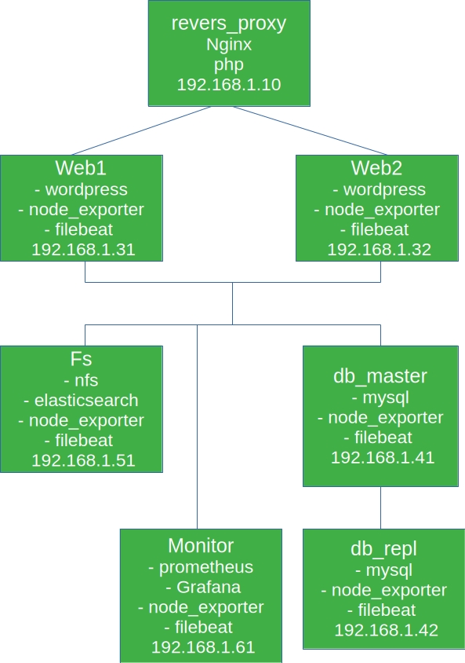

                                  Проектная работа 

Разворачиваем CMS "WORDPRESS" кластер веб-приложений "www.kas.local.ru" c файловым сервером на базе NSF, база mysql c реплицировнием.
Требования:
- балансировка nginx
- включен https -redirect c 80 > 443 c самоподписным сертефикатом
- сбор метрик и настроенный алертинг (node_exporter+alert_manager)
- организован централизованный сбор логов в elasticsearch > визуализация grafana
- организован backup и восстановление из backup (playbook)

  /home/kas/Рабочий стол/Crieket_lesson/Project/cms_all.jpg

Описание виртуальных стендов поднятых на Vagrant: 

- nginx  revers_proxy + php.
- web1,2 wordpress - для распределения нагрузки.
- db_master на mysql, database: wordpress.
- db_repl - репликация по Gtid.
- monitor - система мониторинга (Prometheus, Grafana) < node_exporter + alert_manager c уведомлением в telegram 

- fs - file server - поднят (NFS)-server c автомонтированием на хостах. 
          /opt/
                - www/wordpress (файлы wordpress)
                - elastic/data (база, индексы)
                - prometheus/data (база)
                - backup ( backup базы "wordpress" c хоста db_master и копия папки wordpress с  хоста web1(/opt/www/wordpress))
- Так же на fs установлен и запущен elasticsearch >  на всех хостах установлен filebeat с передачей данных в elasticsearch, а elasticsearch выводит данные в Grafana.

Backup осуществляется силами ansible запуском playbook {#backup_db_wp} при первом запуске он добавлен в {#all_playbook} 
<!-- Можно добавить в crontab для автоматического запуска каждые 5 минут( скрипт попробовал-работаeт, удалил так как каждые 5 минут backup слишком часто, а больше времени  ставить для теста - слишком долго ждать.) -->
Васстановление осуществляется так же запуском playbook {#restore_db_wp}

Доступ к grafana/prometheus сделан через upstreem nginx:
https://kas.local.ru/grafana
https://kas.local.ru/prometheus/targets

