Описание домашнего задания
в Office1 в тестовой подсети появляется сервера с доп интерфейсами и адресами
в internal сети testLAN: 
- testClient1 - 192.168.1.254
- testClient2 - 192.168.2.254
- testServer1-  192.168.1.1
- testServer2-  192.168.2.1

Равести вланами:

testClient1 <-> testServer1

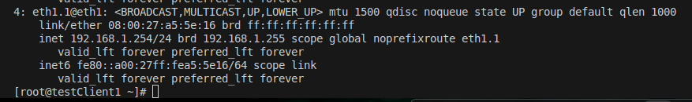

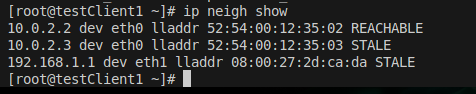

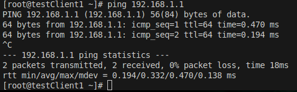

testClient2 <-> testServer2

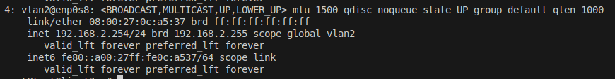

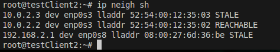

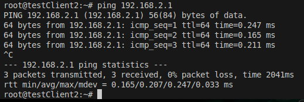

Между centralRouter и inetRouter "пробросить" 2 линка (общая inernal сеть) и объединить их в бонд, проверить работу c отключением интерфейсов

Проверка bonding  на 
inetRouter

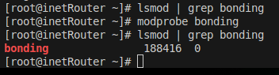

centalRouter

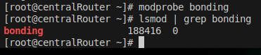

Статик агригирование -active-backup 
InetRouter

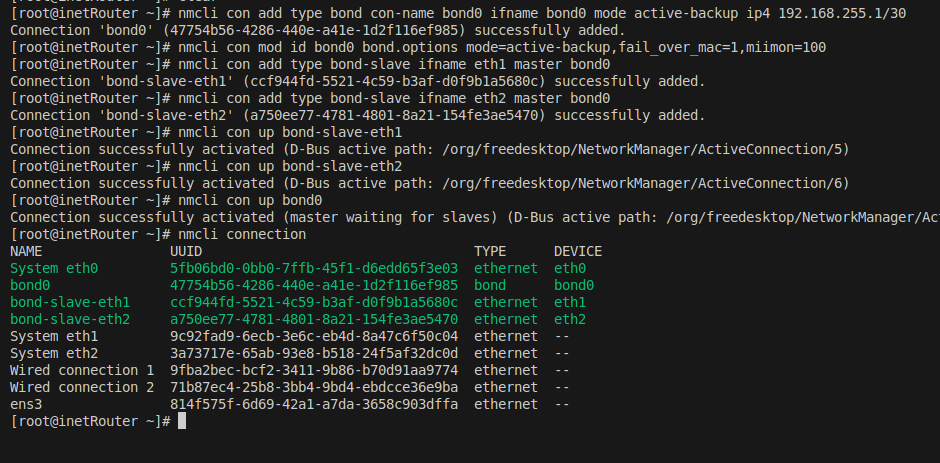

centralRouter
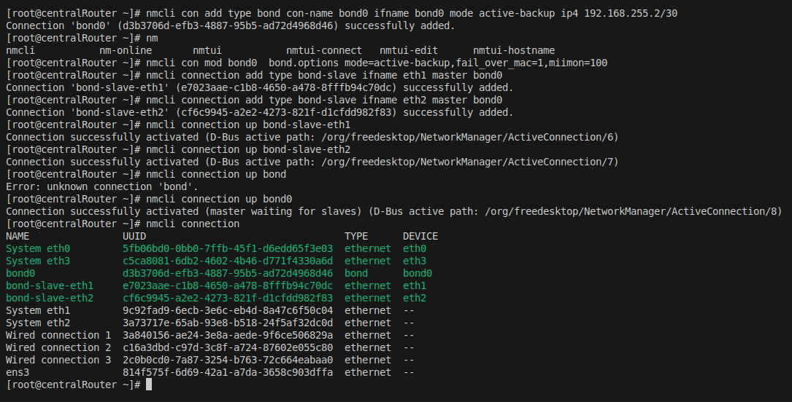

Отключение\Падение eth1 centralRouter

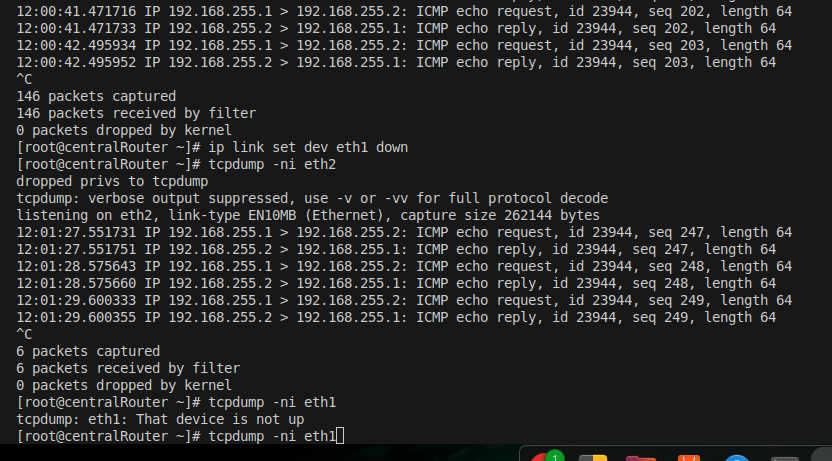
