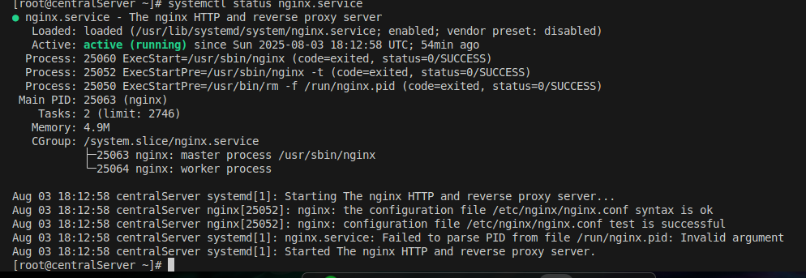

Реализовать knocking port
centralRouter может попасть на ssh inetrRouter через knock скрипт

[vagrant@centralRouter ~]$ ./knock.sh 192.168.255.1 7000 8000 9000
Starting Nmap 7.70 ( https://nmap.org ) at 2025-08-03 17:55 UTC
Warning: 192.168.255.1 giving up on port because retransmission cap hit (0).
Nmap scan report for 192.168.255.1
Host is up (0.00029s latency).

PORT     STATE    SERVICE
7000/tcp filtered afs3-fileserver
MAC Address: 08:00:27:52:49:D2 (Oracle VirtualBox virtual NIC)

Nmap done: 1 IP address (1 host up) scanned in 0.33 seconds
Starting Nmap 7.70 ( https://nmap.org ) at 2025-08-03 17:55 UTC
Warning: 192.168.255.1 giving up on port because retransmission cap hit (0).
Nmap scan report for 192.168.255.1
Host is up (0.00048s latency).

PORT     STATE    SERVICE
8000/tcp filtered http-alt
MAC Address: 08:00:27:52:49:D2 (Oracle VirtualBox virtual NIC)

Nmap done: 1 IP address (1 host up) scanned in 0.33 seconds
Starting Nmap 7.70 ( https://nmap.org ) at 2025-08-03 17:55 UTC
Warning: 192.168.255.1 giving up on port because retransmission cap hit (0).
Nmap scan report for 192.168.255.1
Host is up (0.00028s latency).

PORT     STATE    SERVICE
9000/tcp filtered cslistener
MAC Address: 08:00:27:52:49:D2 (Oracle VirtualBox virtual NIC)

Nmap done: 1 IP address (1 host up) scanned in 0.33 seconds
[vagrant@centralRouter ~]$ ssh 192.168.255.1
The authenticity of host '192.168.255.1 (192.168.255.1)' can't be established.
ECDSA key fingerprint is SHA256:pjwqVhridxsf23bAMjQYNe4w1HliTrQLlkq1Y0i1dmk.
Are you sure you want to continue connecting (yes/no/[fingerprint])? yes
Warning: Permanently added '192.168.255.1' (ECDSA) to the list of known hosts.
Last login: Sun Aug  3 17:09:49 2025 from 10.0.2.2
[vagrant@inetRouter ~]$ 

Запустить nginx на centralServer.

Добавить inetRouter2, который виден(маршрутизируется (host-only тип сети для виртуалки)) с хоста или форвардится порт через локалхост. 

Пробросить 80й порт на inetRouter2 8080.
[vagrant@inetRouter2 ~]$ sudo curl localhost:8080
<!DOCTYPE html PUBLIC "-//W3C//DTD XHTML 1.1//EN" "http://www.w3.org/TR/xhtml11/DTD/xhtml11.dtd">

root@Home:/home/kas/Рабочий стол/Crieket_lesson/iptables# vagrant up
Bringing machine 'inetRouter' up with 'virtualbox' provider...
Bringing machine 'centralRouter' up with 'virtualbox' provider...
Bringing machine 'centralServer' up with 'virtualbox' provider...
Bringing machine 'inetRouter2' up with 'virtualbox' provider...
==> inetRouter: You assigned a static IP ending in ".1" or ":1" to this machine.
==> inetRouter: This is very often used by the router and can cause the
==> inetRouter: network to not work properly. If the network doesn't work
==> inetRouter: properly, try changing this IP.
==> inetRouter: You assigned a static IP ending in ".1" or ":1" to this machine.
==> inetRouter: This is very often used by the router and can cause the
==> inetRouter: network to not work properly. If the network doesn't work
==> inetRouter: properly, try changing this IP.
==> inetRouter: Checking if box 'centos/8' version '1.0.0' is up to date...
==> inetRouter: You assigned a static IP ending in ".1" or ":1" to this machine.
==> inetRouter: This is very often used by the router and can cause the
==> inetRouter: network to not work properly. If the network doesn't work
==> inetRouter: properly, try changing this IP.
==> inetRouter: Machine already provisioned. Run `vagrant provision` or use the `--provision`
==> inetRouter: flag to force provisioning. Provisioners marked to run always will still run.
==> centralRouter: You assigned a static IP ending in ".1" or ":1" to this machine.
==> centralRouter: This is very often used by the router and can cause the
==> centralRouter: network to not work properly. If the network doesn't work
==> centralRouter: properly, try changing this IP.
==> centralRouter: Importing base box 'centos/8'...
==> centralRouter: Matching MAC address for NAT networking...
==> centralRouter: You assigned a static IP ending in ".1" or ":1" to this machine.
==> centralRouter: This is very often used by the router and can cause the
==> centralRouter: network to not work properly. If the network doesn't work
==> centralRouter: properly, try changing this IP.
==> centralRouter: Checking if box 'centos/8' version '1.0.0' is up to date...
==> centralRouter: Setting the name of the VM: iptables_centralRouter_1754241810647_19964
==> centralRouter: Fixed port collision for 22 => 2222. Now on port 2207.
==> centralRouter: Clearing any previously set network interfaces...
==> centralRouter: Preparing network interfaces based on configuration...
    centralRouter: Adapter 1: nat
    centralRouter: Adapter 2: intnet
    centralRouter: Adapter 3: intnet
    centralRouter: Adapter 4: intnet
    centralRouter: Adapter 5: intnet
    centralRouter: Adapter 6: intnet
    centralRouter: Adapter 7: intnet
    centralRouter: Adapter 8: hostonly
==> centralRouter: Forwarding ports...
    centralRouter: 22 (guest) => 2207 (host) (adapter 1)
==> centralRouter: Booting VM...
==> centralRouter: Waiting for machine to boot. This may take a few minutes...
    centralRouter: SSH address: 127.0.0.1:2207
    centralRouter: SSH username: vagrant
    centralRouter: SSH auth method: private key
    centralRouter: 
    centralRouter: Vagrant insecure key detected. Vagrant will automatically replace
    centralRouter: this with a newly generated keypair for better security.
    centralRouter: 
    centralRouter: Inserting generated public key within guest...
    centralRouter: Removing insecure key from the guest if it's present...
    centralRouter: Key inserted! Disconnecting and reconnecting using new SSH key...
==> centralRouter: Machine booted and ready!
==> centralRouter: Checking for guest additions in VM...
    centralRouter: No guest additions were detected on the base box for this VM! Guest
    centralRouter: additions are required for forwarded ports, shared folders, host only
    centralRouter: networking, and more. If SSH fails on this machine, please install
    centralRouter: the guest additions and repackage the box to continue.
    centralRouter: 
    centralRouter: This is not an error message; everything may continue to work properly,
    centralRouter: in which case you may ignore this message.
==> centralRouter: Setting hostname...
==> centralRouter: Configuring and enabling network interfaces...
==> centralRouter: Rsyncing folder: /home/kas/Рабочий стол/Crieket_lesson/iptables/ => /vagrant
==> centralRouter: Running provisioner: shell...
    centralRouter: Running: inline script
==> centralRouter: Running provisioner: ansible...
    centralRouter: Running ansible-playbook...

PLAY [Config centralRouter] ****************************************************

TASK [Gathering Facts] *********************************************************
ok: [centralRouter]

TASK [Install epel-release] ****************************************************
changed: [centralRouter]

TASK [Install packages] ********************************************************
changed: [centralRouter]

TASK [Set up forward packages across routers] **********************************
changed: [centralRouter]

TASK [Disable default route] ***************************************************
changed: [centralRouter]

TASK [Add default gateway for centralRouter] ***********************************
changed: [centralRouter]

TASK [Add static route for office1] ********************************************
changed: [centralRouter]

TASK [Add static route for office2] ********************************************
changed: [centralRouter]

TASK [Restart network service] *************************************************
changed: [centralRouter]

TASK [Restart network service] *************************************************
changed: [centralRouter]

TASK [Create .ssh directory] ***************************************************
ok: [centralRouter]

TASK [Add ssh keys] ************************************************************
changed: [centralRouter]

TASK [Add knock script] ********************************************************
changed: [centralRouter]

PLAY RECAP *********************************************************************
centralRouter              : ok=13   changed=11   unreachable=0    failed=0    skipped=0    rescued=0    ignored=0   

root@Home:/home/kas/Рабочий стол/Crieket_lesson/iptables# vagrant up centralServer
Bringing machine 'centralServer' up with 'virtualbox' provider...
==> centralServer: Importing base box 'centos/8'...
==> centralServer: Matching MAC address for NAT networking...
==> centralServer: Checking if box 'centos/8' version '1.0.0' is up to date...
==> centralServer: Setting the name of the VM: iptables_centralServer_1754244274747_87828
==> centralServer: Fixed port collision for 22 => 2222. Now on port 2208.
==> centralServer: Clearing any previously set network interfaces...
==> centralServer: Preparing network interfaces based on configuration...
    centralServer: Adapter 1: nat
    centralServer: Adapter 2: intnet
    centralServer: Adapter 8: hostonly
==> centralServer: Forwarding ports...
    centralServer: 22 (guest) => 2208 (host) (adapter 1)
==> centralServer: Booting VM...
==> centralServer: Waiting for machine to boot. This may take a few minutes...
    centralServer: SSH address: 127.0.0.1:2208
    centralServer: SSH username: vagrant
    centralServer: SSH auth method: private key
    centralServer: 
    centralServer: Vagrant insecure key detected. Vagrant will automatically replace
    centralServer: this with a newly generated keypair for better security.
    centralServer: 
    centralServer: Inserting generated public key within guest...
    centralServer: Removing insecure key from the guest if it's present...
    centralServer: Key inserted! Disconnecting and reconnecting using new SSH key...
==> centralServer: Machine booted and ready!
==> centralServer: Checking for guest additions in VM...
    centralServer: No guest additions were detected on the base box for this VM! Guest
    centralServer: additions are required for forwarded ports, shared folders, host only
    centralServer: networking, and more. If SSH fails on this machine, please install
    centralServer: the guest additions and repackage the box to continue.
    centralServer: 
    centralServer: This is not an error message; everything may continue to work properly,
    centralServer: in which case you may ignore this message.
==> centralServer: Setting hostname...
==> centralServer: Configuring and enabling network interfaces...
==> centralServer: Rsyncing folder: /home/kas/Рабочий стол/Crieket_lesson/iptables/ => /vagrant
==> centralServer: Running provisioner: shell...
    centralServer: Running: inline script
==> centralServer: Running provisioner: ansible...
    centralServer: Running ansible-playbook...

PLAY [Config centralServer] ****************************************************

TASK [Gathering Facts] *********************************************************
ok: [centralServer]

TASK [Install epel-release] ****************************************************
changed: [centralServer]

TASK [Install packages] ********************************************************
changed: [centralServer]

TASK [Disable default route] ***************************************************
changed: [centralServer]

TASK [Add default gateway for centralRouter] ***********************************
changed: [centralServer]

TASK [Restart network service] *************************************************
changed: [centralServer]

TASK [Restart network service] *************************************************
changed: [centralServer]

TASK [Install nginx] ***********************************************************
changed: [centralServer]

TASK [Start and enable nginx] **************************************************
changed: [centralServer]

PLAY RECAP *********************************************************************
centralServer              : ok=9    changed=8    unreachable=0    failed=0    skipped=0    rescued=0    ignored=0   
==> inetRouter2: Importing base box 'centos/8'...
==> inetRouter2: Matching MAC address for NAT networking...
==> inetRouter2: Checking if box 'centos/8' version '1.0.0' is up to date...
==> inetRouter2: Setting the name of the VM: iptables_inetRouter2_1754242275769_23298
==> inetRouter2: Fixed port collision for 22 => 2222. Now on port 2209.
==> inetRouter2: Clearing any previously set network interfaces...
==> inetRouter2: Preparing network interfaces based on configuration...
    inetRouter2: Adapter 1: nat
    inetRouter2: Adapter 8: hostonly
==> inetRouter2: Forwarding ports...
    inetRouter2: 22 (guest) => 2209 (host) (adapter 1)
==> inetRouter2: Booting VM...
==> inetRouter2: Waiting for machine to boot. This may take a few minutes...
    inetRouter2: SSH address: 127.0.0.1:2209
    inetRouter2: SSH username: vagrant
    inetRouter2: SSH auth method: private key
    inetRouter2: 
    inetRouter2: Vagrant insecure key detected. Vagrant will automatically replace
    inetRouter2: this with a newly generated keypair for better security.
    inetRouter2: 
    inetRouter2: Inserting generated public key within guest...
    inetRouter2: Removing insecure key from the guest if it's present...
    inetRouter2: Key inserted! Disconnecting and reconnecting using new SSH key...
==> inetRouter2: Machine booted and ready!
==> inetRouter2: Checking for guest additions in VM...
    inetRouter2: No guest additions were detected on the base box for this VM! Guest
    inetRouter2: additions are required for forwarded ports, shared folders, host only
    inetRouter2: networking, and more. If SSH fails on this machine, please install
    inetRouter2: the guest additions and repackage the box to continue.
    inetRouter2: 
    inetRouter2: This is not an error message; everything may continue to work properly,
    inetRouter2: in which case you may ignore this message.
==> inetRouter2: Setting hostname...
==> inetRouter2: Configuring and enabling network interfaces...
==> inetRouter2: Rsyncing folder: /home/kas/Рабочий стол/Crieket_lesson/iptables/ => /vagrant
==> inetRouter2: Running provisioner: shell...
    inetRouter2: Running: inline script
==> inetRouter2: Running provisioner: ansible...
    inetRouter2: Running ansible-playbook...

PLAY [Config inetRouter] *******************************************************

TASK [Gathering Facts] *********************************************************
ok: [inetRouter2]
TASK [Install epel-release] ****************************************************
changed: [inetRouter2]

TASK [Install packages] ********************************************************
changed: [inetRouter2]

TASK [Copy iptables config] ****************************************************
changed: [inetRouter2]

TASK [Start and enable iptables service] ***************************************
changed: [inetRouter2]

TASK [Set up forward packages across routers] **********************************
changed: [inetRouter2]

TASK [Set up localnet] *********************************************************
changed: [inetRouter2]

PLAY RECAP *********************************************************************
inetRouter2                : ok=7    changed=6    unreachable=0    failed=0    skipped=0    rescued=0    ignored=0   

